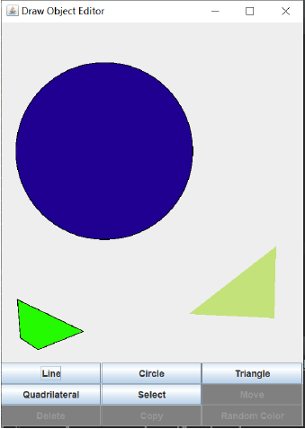

# Drawing-Board

In this following program users can draw line, circle, triangle and quadrilateral. The created graphics can be selected, then user can move, copy, delete, randomly color the graphics object.

An example of the Drawing Board is shown below.

